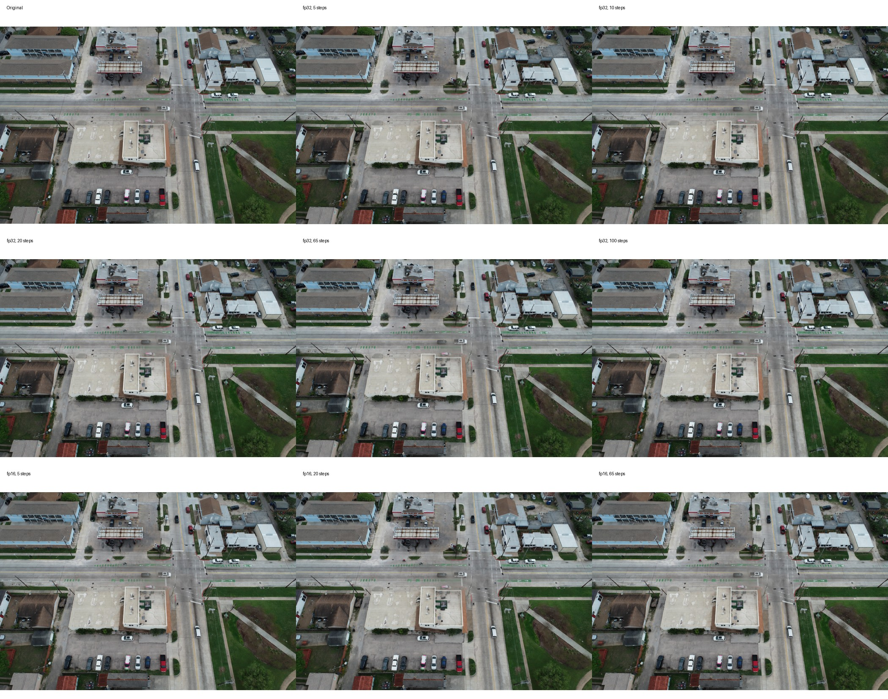

# CDC Image Compression on DeltaAI

Lossy image compression with Conditional Diffusion Models, adapted for running on [NSF DeltaAI](https://docs.ncsa.illinois.edu/systems/deltaai/).

Based on: [Lossy Image Compression with Conditional Diffusion Models](https://arxiv.org/pdf/2209.06950.pdf)

## SC26 Experiment Snapshot

Updated: 2026-04-26

This repository is now organized around the SC26 CDC experiment design:

| Owner | Pipeline | Main question | Current status |
|-------|----------|---------------|----------------|
| Jacob | Compression / encoding | How fast can we shrink the data? | Compression evaluation workflow and GH200 100-image results are documented below. |
| Yifan | Reconstruction / decoding / diffusion | How fast can we use the data again? | DeltaAI reconstruction profiling, step sweep, batch-size pilot, plots, and visual examples are complete for this cycle. |

Use the top sections as the project index. The older detailed setup and evaluation notes are preserved below as reference rather than removed.

## Compute Platform Baseline

This repository currently tracks experiments across two NCSA systems:

| System | Login | Confirmed GPU target | Account / allocation | Current role |
|--------|-------|----------------------|----------------------|--------------|
| DeltaAI | `ssh yyang48@dtai-login.delta.ncsa.illinois.edu` or `ssh yyang48@gh-login01.delta.ncsa.illinois.edu` | NVIDIA GH200 | `bfod-dtai-gh` | Completed 2026-04-26 reconstruction experiments |
| Delta | `ssh yyang48@login.delta.ncsa.illinois.edu` or `ssh yyang48@dt-login.delta.ncsa.illinois.edu` | NVIDIA H200 visible through `gpuH200x8` and `gpuH200x8-interactive` | `bfod-delta-gpu` | Future GH200-vs-H200 comparison target |

Important hardware distinction:

- The committed 2026-04-26 results are **DeltaAI GH200** results.
- Delta is a separate NCSA system. On 2026-04-28, Delta showed H200 partitions under the `bfod-delta-gpu` account.
- No H100 partition was visible in the checked Delta `sinfo` output, so H100 is not yet a confirmed comparison target.
- The next realistic hardware comparison is **DeltaAI GH200 vs Delta H200**.

Delta resource check recorded on 2026-04-28:

| Item | Value |
|------|-------|
| Delta login host reached | `dt-login02.delta.ncsa.illinois.edu` |
| Delta account | `bfod-delta-gpu` |
| Delta GPU balance | `1076` of `2037` GPU hours |
| H200 batch partition | `gpuH200x8` |
| H200 interactive partition | `gpuH200x8-interactive` |
| H200 nodes | `gpue[01-08]` |

Use this H200 smoke test before porting the full workflow to Delta:

```bash
srun --account=bfod-delta-gpu --partition=gpuH200x8-interactive \
     --nodes=1 --ntasks=1 --gres=gpu:h200:1 --mem=32G \
     --time=00:10:00 --pty bash
```

## Phase Timeline and Task Index

| Phase | Date / cycle | Task | Main files and outputs |
|-------|--------------|------|------------------------|
| Phase 0 | Initial setup | Port CDC code and DeltaAI paths into this repo. | `environment.yml`, `epsilonparam/`, `xparam/`, `scripts/run_deltaai.sh` |
| Phase 1 | GH200 compression evaluation | Run x-param compression evaluation on 100 drone images and summarize bitrate / compression ratio. | `xparam/evaluate_compression.py`, `xparam/run_evaluation.sh`, `xparam/run_b02048_resume.sh` |
| Phase 2 | 2026-04-25 | Add reconstruction profiling workflow for Yifan's SC26 task. | `xparam/profile_reconstruction.py`, `xparam/sweep_steps.py`, `xparam/plot_results.py`, `xparam/run_profiling_sweep.sh` |
| Phase 3 | 2026-04-26 | Run DeltaAI reconstruction experiments: single-image sanity test, batch-size pilot, repeated step sweep, fp32/fp16 comparison, and plotting. | `results/2026-04-26-reconstruction/`, `docs/progress_2026-04-25_for_2026-05-01_meeting.md` |
| Phase 4 | Before 2026-05-01 meeting | Prepare slide-ready conclusions and align figure format with Jacob's compression results. | Reconstruction plots, summary CSVs, visual comparison image, meeting notes |

## Current Reconstruction Results for Yifan

The reconstruction experiments were run on NSF ACCESS DeltaAI GH200 with full-resolution drone images cropped to `5440 x 3648` pixels.

Key conclusions for the 2026-05-01 meeting:

- Diffusion inference is the dominant bottleneck in reconstruction.
- The realistic full-image reconstruction batch size is `1`; `batch_size=2` caused CUDA OOM.
- Reducing denoising steps is the strongest speed lever.
- The 5-step setting is the fastest measured setting so far and passed the first visual check on image `100_0005_0001`.
- fp16 reduces memory and improves speed, but fp16 BPP is invalid in the current output, so use fp32 for bitrate and compression-ratio discussion.

Representative step-sweep results:

| Precision | Steps | Batch | Inference sec/image | Images/hour | Peak GPU memory | PSNR | SSIM | BPP |
|-----------|-------|-------|---------------------|-------------|-----------------|------|------|-----|
| fp32 | 5 | 1 | 11.27 | 319.3 | 52.2 GB | 31.57 | 0.9066 | 0.3300 |
| fp32 | 20 | 1 | 44.37 | 81.2 | 52.2 GB | 30.47 | 0.8961 | 0.3300 |
| fp32 | 65 | 1 | 143.67 | 25.1 | 52.2 GB | 29.92 | 0.8845 | 0.3300 |
| fp16 | 5 | 1 | 10.47 | 343.8 | 34.2 GB | 31.63 | 0.9063 | invalid |
| fp16 | 65 | 1 | 133.68 | 26.9 | 34.2 GB | 30.03 | 0.8839 | invalid |

Visual check:



## Results Index

The current report-ready reconstruction artifacts are stored in:

```text
results/2026-04-26-reconstruction/
├── plots/                  # speed, quality, memory, and trade-off figures
├── reports/                # fp32/fp16 profile reports
├── tables/                 # sweep summary CSVs
└── visual_examples_small/  # compressed visual examples for GitHub and slides
```

Important files:

| File | Use |
|------|-----|
| `results/2026-04-26-reconstruction/tables/sweep_summary.csv` | Main repeated step-sweep summary |
| `results/2026-04-26-reconstruction/tables/batch_pilot_summary.csv` | Batch-size pilot summary |
| `results/2026-04-26-reconstruction/plots/plot_time_vs_steps.png` | Reconstruction time vs denoising steps |
| `results/2026-04-26-reconstruction/plots/plot_quality_vs_speed.png` | Speed-quality trade-off |
| `results/2026-04-26-reconstruction/plots/plot_memory_vs_steps.png` | GPU memory comparison |
| `results/2026-04-26-reconstruction/reports/profile_report_fp32.txt` | Detailed 65-step fp32 profile |
| `results/2026-04-26-reconstruction/reports/profile_report_fp16.txt` | Detailed 65-step fp16 profile |
| `results/2026-04-26-reconstruction/visual_examples_small/comparison_100_0005_0001.jpg` | Slide-ready visual comparison |

## Current DeltaAI Runtime Setup

The working DeltaAI setup for the 2026-04-26 reconstruction run was:

```bash
module load python/miniforge3_pytorch/2.10.0
conda activate base
export PYTHONPATH=$HOME/.local/lib/python3.12/site-packages:$PYTHONPATH
python -m pip install --user scikit-image compressai einops lpips ema-pytorch tqdm matplotlib pandas --quiet
```

The checkpoint used for the current reconstruction results was:

```text
/projects/bfod/$USER/cdc-deltaai/weights/x_param/image-l2-use_weight5-vimeo-d64-t8193-b0.2048-x-cosine-01-float32-aux0.9lpips_2.pt
```

## Delta vs DeltaAI Hardware Note

Use this distinction when describing the experiments:

- **DeltaAI** is the system used for the current reconstruction experiments. The [official DeltaAI documentation](https://docs.ncsa.illinois.edu/systems/deltaai/en/latest/index.html) describes it as powered by the NVIDIA **GH200 Grace Hopper Superchip**.
- **Delta** is a related but separate NCSA system. The [Delta job-accounting documentation](https://docs.ncsa.illinois.edu/systems/delta/en/latest/user_guide/job_accounting.html) lists an `8-way H200` GPU node type.
- Therefore, the 2026-04-26 results in this repository should be described as **DeltaAI GH200** results, not H100 or H200 results.
- A Delta H200 comparison can be treated as future work only if the project allocation, partition name, and runtime environment are confirmed.

ACCESS project resource snapshot from the portal, recorded 2026-04-26:

| Project | Resource | Status | Balance | End date | Username |
|---------|----------|--------|---------|----------|----------|
| `CIV250023: Upscaling for Flood Resilience: A Benchmarking Study` | NCSA Delta GPU | Active | 1.08K of 2.04K GPU hours remaining (53%) | 2026-08-07 | `yyang48` |
| `CIV250023: Upscaling for Flood Resilience: A Benchmarking Study` | NCSA DeltaAI | Active | 93 of 141 GPU hours remaining (66%) | 2026-08-07 | `yyang48` |

Delta login and resource check completed on 2026-04-28:

```text
Host: dt-login02.delta.ncsa.illinois.edu
Account: bfod-delta-gpu
Balance: 1076 of 2037 GPU hours
```

Observed Delta GPU partitions:

| Partition | GRES | Nodes | Notes |
|-----------|------|-------|-------|
| `gpuH200x8` | `gpu:h200:8` | 8 | Batch H200 partition, nodes `gpue[01-08]` |
| `gpuH200x8-interactive` | `gpu:h200:8` | 8 | Interactive H200 partition, nodes `gpue[01-08]` |
| `gpuA100x4` | `gpu:nvidia_a100:4` | 99 | Batch A100 4-GPU partition |
| `gpuA100x4-interactive` | `gpu:nvidia_a100:4` | 100 | Interactive A100 4-GPU partition |
| `gpuA100x8` | `gpu:nvidia_a100:8` | 6 | Batch A100 8-GPU partition |
| `gpuA100x8-interactive` | `gpu:nvidia_a100:8` | 6 | Interactive A100 8-GPU partition |
| `gpuA40x4` | `gpu:nvidia_a40:4` | 98 | Batch A40 partition |
| `gpuA40x4-interactive` | `gpu:nvidia_a40:4` | 100 | Interactive A40 partition |

No H100 partition was visible in the `sinfo` output from Delta on 2026-04-28. The next hardware comparison target should therefore be **DeltaAI GH200 vs Delta H200**, unless H100 access is confirmed separately.

## Future Delta Hardware Comparison

The current repository name and completed workflow are DeltaAI-focused, but the ACCESS project also has Delta GPU allocation. If the group wants to compare GH200 against H200 or any other Delta GPU, use Delta as a separate system.

Delta login hostnames from the official Delta documentation:

```bash
ssh yyang48@login.delta.ncsa.illinois.edu
# or
ssh yyang48@dt-login.delta.ncsa.illinois.edu
```

After logging into Delta, confirm available hardware and charging before copying data or running jobs:

```bash
sinfo -o "%P %G %D %N"
accounts
module avail 2>&1 | grep -i -E "python|conda|cuda|pytorch"
```

H200 interactive smoke test command:

```bash
srun --account=bfod-delta-gpu --partition=gpuH200x8-interactive \
     --nodes=1 --ntasks=1 --gres=gpu:h200:1 --mem=32G \
     --time=00:10:00 --pty bash
```

Only after the Delta partition, account, and runtime environment are confirmed should we port the same experiment structure:

1. Single-image sanity test.
2. Batch-size pilot.
3. Repeated step sweep.
4. Same plots, tables, profile reports, and visual examples.

Current task status:

- This week's required reconstruction code runs are complete on DeltaAI GH200.
- Jacob can be told that the realistic full-image reconstruction batch size is `1`.
- More visual examples or a Delta H200 comparison are optional future work, not blockers for this week's task.

## Compression Evaluation Goal

The compression-side evaluation task is to:

1. Apply the compression model on 100 drone images.
2. Report the overall compression rate from the evaluation output.
3. Compare the total size of the original images and the reconstructed images.
4. Run the same evaluation workflow on additional confirmed GPU targets if needed:
- DeltaAI GH200, already used for the current workflow
- Delta H200, possible future comparison if allocation and partition access are confirmed

For each run, collect and summarize the following outputs:
- `compression_report.txt`
- `compression_results.csv`
- average BPP
- overall compression ratio
- total original image size
- total reconstructed image size
- file size ratio between original and reconstructed images

## Compression Evaluation Status

The DeltaAI x-parameterization workflow has been debugged and completed successfully on GH200 for the full 100-image evaluation sweep across all 6 checkpoints.

Validated progress so far:
- The DeltaAI environment issues were resolved, including Python user site-packages visibility and missing runtime dependencies.
- The x-param evaluation script was updated to crop each input image to multiples of 64 so the compressor and hyperprior remain shape-aligned during inference.
- A single-image GH200 validation run completed successfully and produced both `compression_report.txt` and `compression_results.csv`.
- The full 100-image GH200 sweep was executed across all 6 checkpoints.
- The final checkpoint (`b0.2048`) hit the walltime limit during the first batch run, so the remaining images were completed with a targeted resume job and then merged into a full 100-image result set.

## Final GH200 Results for 100 Images

| Checkpoint | Average BPP | Compression Ratio | Total Original Size | Total Reconstructed Size | File Size Ratio |
|-----------|-------------|-------------------|---------------------|--------------------------|-----------------|
| `b0.0032` | 0.4394 bits/pixel | 54.62x | 834.7 MB | 2.4 GB | 0.33x |
| `b0.0064` | 0.2872 bits/pixel | 83.58x | 834.7 MB | 2.3 GB | 0.36x |
| `b0.0128` | 0.1632 bits/pixel | 147.09x | 834.7 MB | 2.1 GB | 0.38x |
| `b0.0512` | 0.7444 bits/pixel | 32.24x | 834.7 MB | 3.0 GB | 0.27x |
| `b0.1024` | 0.5388 bits/pixel | 44.54x | 834.7 MB | 2.9 GB | 0.28x |
| `b0.2048` | 0.3438 bits/pixel | 69.82x | 834.6 MB | 2.9 GB | 0.29x |

Interpretation:
- `b0.0128` produced the lowest average bitrate and the highest compression ratio relative to uncompressed 24-bit RGB.
- Across all checkpoints, the reconstructed PNG outputs were still larger than the original JPEG files, so the BPP-based compression result and the stored-file-size comparison should be interpreted as different metrics.
- The GH200 runtime was consistently about 143.4 seconds per image with 65 denoising steps.

Remaining work:
- If needed, run the same evaluation on Delta H200 once the partition name, allocation charging, and environment are confirmed.
- Compare DeltaAI GH200 and Delta H200 runtime and output statistics side by side.

## GPU Partition Summary

The currently visible GPU-backed partitions from `sinfo -o "%P %G %D %N"` are:

- `full` — NVIDIA GH200 120GB, 4 GPUs per node
- `ghx4` — NVIDIA GH200 120GB, 4 GPUs per node
- `ghx4-interactive` — NVIDIA GH200 120GB, 4 GPUs per node
- `test` — no GPU nodes reported

Practical interpretation:
- `ghx4` is the confirmed batch partition currently used for the GH200 evaluation jobs.
- `ghx4-interactive` is the confirmed interactive partition currently used for debugging and validation runs.
- `full` also reports GH200 nodes, but the current workflow has been validated on `ghx4` and `ghx4-interactive`.
- Delta H200 is documented under the separate Delta system. It is not the hardware used for the current DeltaAI run.

In other words, the currently confirmed and usable GPU target in this environment is GH200.

## Repository Structure

```
.
├── epsilonparam/                      # epsilon-parameterization model
├── xparam/                            # x-parameterization model
│   ├── evaluate_compression.py        # evaluation script (compression rate + size report)
│   ├── profile_reconstruction.py      # profiling script (timing breakdown + PSNR/SSIM + GPU memory)
│   ├── sweep_steps.py                 # parameter sweep over denoising steps and precision
│   ├── plot_results.py                # generates speed/quality trade-off plots from sweep CSV
│   ├── run_evaluation.sh              # SLURM job: 100-image compression evaluation
│   ├── run_b02048_resume.sh           # SLURM job: targeted resume for unfinished b0.2048 images
│   └── run_profiling_sweep.sh         # SLURM job: full profiling + step sweep + plotting
├── docs/                              # experiment plans and meeting-cycle progress notes
├── results/                           # lightweight report-ready results committed to GitHub
│   └── 2026-04-26-reconstruction/     # Yifan reconstruction outputs for the 2026-05-01 meeting cycle
├── data/                              # data placement notes; large data stays on DeltaAI
├── imgs/                              # sample Kodak test images
├── scripts/                           # DeltaAI helper scripts
└── environment.yml                    # conda environment
```

## Model Weights

HuggingFace: [rhyang/CDC_params](https://huggingface.co/rhyang/CDC_params)
- `epsilon_lpips0.9.pt` — use with `--lpips_weight 0.9`
- `epsilon_lpips0.0.pt` — use with `--lpips_weight 0.0`
- x-param weights are ~2x larger (EMA + latest model saved; only EMA is loaded)

---

## Running on NSF DeltaAI (UIUC)

The commands below are preserved as the detailed DeltaAI reference for the original compression evaluation workflow. For the current reconstruction runtime used on 2026-04-26, start from the "Current DeltaAI Runtime Setup" section above.

### Step 1: Log in to DeltaAI

```bash
ssh yyang48@dtai-login.delta.ncsa.illinois.edu
```

Use DUO two-factor authentication when prompted.

---

### Step 2: Set up your working directory

| Path | Use |
|------|-----|
| `$HOME` | Code, small files |
| `/scratch/<allocation>/$USER/` | Large data, weights, outputs (faster I/O) |

```bash
mkdir -p /projects/bfod/$USER/cdc-deltaai
cd /projects/bfod/$USER/cdc-deltaai
```

---

### Step 3: Clone this repo on DeltaAI

```bash
git clone https://github.com/rayford295/sc26-cdc-deltaai.git code
cd code
```

---

### Step 4: Transfer your image data

From your **local machine**:

```bash
# Transfer drone images (e.g., 100_0005/ dataset)
rsync -avz /path/to/your/images/ \
  yyang48@dtai-login.delta.ncsa.illinois.edu:/projects/bfod/$USER/cdc-deltaai/data/imgs/
```

---

### Step 5: Download model weights

```bash
# On DeltaAI
cd /projects/bfod/$USER/cdc-deltaai
mkdir -p weights

module load anaconda3
conda activate exp_pytorch
pip install huggingface_hub --quiet

python -c "
from huggingface_hub import snapshot_download
snapshot_download(repo_id='rhyang/CDC_params', local_dir='./weights')
"
```

---

### Step 6: Set up the conda environment

```bash
module load anaconda3

# First time only (~10 min)
conda env create -f code/environment.yml
conda activate exp_pytorch
```

> If `environment.yml` fails due to CUDA version conflicts, install manually:
> ```bash
> conda create -n exp_pytorch python=3.9
> conda activate exp_pytorch
> conda install pytorch=2.0.0 torchvision pytorch-cuda=11.8 -c pytorch -c nvidia
> pip install compressai einops ema-pytorch lpips opencv-python scikit-image timm tqdm
> ```

---

### Step 7: Submit the evaluation job

The default sweep script now processes 100 images across all 6 x-param checkpoints:

```bash
cd /projects/bfod/$USER/cdc-deltaai/code
mkdir -p xparam/logs output/evaluation

sbatch xparam/run_evaluation.sh
```

If the final checkpoint sweep is interrupted and only the unfinished `b0.2048` images need to be completed, use:

```bash
sbatch xparam/run_b02048_resume.sh
```

Monitor the job:

```bash
squeue -u $USER                          # check status
tail -f xparam/logs/eval_<job_id>.log   # live output
scancel <job_id>                         # cancel if needed
```

---

### Step 8: Retrieve results

From your **local machine**:

```bash
rsync -avz \
  yyang48@dtai-login.delta.ncsa.illinois.edu:/projects/bfod/$USER/cdc-deltaai/output/ \
  ./output/
```

The output folder will contain:
- `compression_report.txt` — overall compression rate summary
- `compression_results.csv` — per-image BPP and file size data
- `*_recon.png` — reconstructed images

---

### Step 9: Interactive session (for debugging)

```bash
srun --account=bfod-dtai-gh --partition=ghx4-interactive \
     --nodes=1 --ntasks=1 --gres=gpu:1 --mem=32G \
     --time=01:00:00 --pty bash
```

---

## DeltaAI GPU Partitions

| Partition | GPU | Notes |
|-----------|-----|-------|
| `ghx4` | 4x NVIDIA GH200 120GB | Current confirmed batch partition |
| `ghx4-interactive` | 4x NVIDIA GH200 120GB | Current confirmed interactive partition |
| `full` | 4x NVIDIA GH200 120GB | Visible in `sinfo`, but not the current validated workflow target |

Delta is separate from DeltaAI. The Delta documentation lists an `8-way H200` GPU node type, but the current repository results were generated on DeltaAI GH200.

---

## Evaluation Script

`xparam/evaluate_compression.py` processes N drone images through the CDC model and reports:

1. **Overall compression rate** — average BPP vs uncompressed RGB (24 bpp)
2. **File size comparison** — total original JPEG size vs reconstructed PNG size

It also supports `--start_index` for partial resume runs when only a subset of the sorted image list needs to be processed.

```bash
python xparam/evaluate_compression.py \
  --ckpt        /path/to/checkpoint.pt \
  --img_dir     /path/to/images \
  --out_dir     /path/to/output \
  --n_images    100 \
  --start_index 0 \
  --lpips_weight 0.9
```

---

---

## Reconstruction Profiling and Optimization (Yifan's Task)

### Goal

The reconstruction (decoding / diffusion sampling) pipeline currently takes **~143 seconds per image** on GH200 with 65 denoising steps. The goal is to:

1. **Profile** the pipeline to understand where time is spent (model load vs. inference vs. post-processing).
2. **Sweep parameters** — especially the number of denoising steps — to map the speed / quality trade-off.
3. **Benchmark fp16 vs. fp32** to see if mixed precision saves time without hurting quality.
4. **Identify the optimal configuration** (fewest steps where PSNR/SSIM plateau).

### New Scripts

| Script | What it does |
|--------|-------------|
| `profile_reconstruction.py` | Profiles one configuration in detail: split timing (load / infer / postproc), GPU memory, PSNR, SSIM |
| `sweep_steps.py` | Sweeps step counts, precision, batch size, and repeats — model loaded once, reused for all configs |
| `plot_results.py` | Reads `sweep_results.csv` and saves 5 PNG plots |
| `run_profiling_sweep.sh` | SLURM job that runs profiling, batch pilot, repeated sweep, and plotting |

### Step-by-Step Instructions

#### Step 1 — Install extra dependencies

`scikit-image` and the CDC helper libraries are not always available in DeltaAI's
shared PyTorch environment. Install them once into your user site:

```bash
module load python/miniforge3_pytorch/2.10.0
conda activate base
export PYTHONPATH=$HOME/.local/lib/python3.12/site-packages:$PYTHONPATH
python -m pip install --user scikit-image compressai einops lpips ema-pytorch tqdm matplotlib pandas --quiet
```

> **Note:** Do this in an interactive session or add it to the job script.
> The `run_profiling_sweep.sh` script already includes this pip install step.

---

#### Step 2 — Edit paths in the SLURM script

Open `xparam/run_profiling_sweep.sh` and update the path variables at the top:

```bash
REPO_DIR="/projects/bfod/$USER/cdc-deltaai/code"   # where you cloned the repo
IMG_DIR="/projects/bfod/$USER/cdc-deltaai/data/imgs"  # drone images directory
WEIGHT_DIR="/projects/bfod/$USER/cdc-deltaai/weights" # downloaded model weights

# Pick whichever checkpoint you want to profile (b0.2048 recommended as the largest)
CKPT="${WEIGHT_DIR}/x_param/image-l2-use_weight5-vimeo-d64-t8193-b0.2048-x-cosine-01-float32-aux0.9lpips_2.pt"
LPIPS_WEIGHT=0.9
```

> **Note:** The script uses `$USER` automatically, so only the base paths need editing.

---

#### Step 3 — Create the log directory

```bash
mkdir -p xparam/logs
```

SLURM writes stdout/stderr to `xparam/logs/profiling_<jobid>.log`.

---

#### Step 4 — Submit the job

```bash
cd /projects/bfod/$USER/cdc-deltaai/code
sbatch xparam/run_profiling_sweep.sh
```

Monitor progress:

```bash
squeue -u $USER                                   # check if the job is running
tail -f xparam/logs/profiling_<jobid>.log         # live log output
```

Estimated wall time: **~5–7 hours** for the full profiling job, including the batch-size pilot and 3 repeated step-sweep runs. The job script requests 8 hours.

---

#### Step 5 — Run a quick sanity check first (optional but recommended)

Before submitting the full sweep, validate that the scripts work with an interactive session:

```bash
# Start an interactive GPU session
srun --account=bfod-dtai-gh --partition=ghx4-interactive \
     --nodes=1 --ntasks=1 --gres=gpu:1 --mem=32G \
     --time=00:30:00 --pty bash

module load python/miniforge3_pytorch/2.10.0
conda activate base
export PYTHONPATH=$HOME/.local/lib/python3.12/site-packages:$PYTHONPATH
cd /projects/bfod/$USER/cdc-deltaai/code/xparam

# Quick profile: 1 image, 20 steps
python profile_reconstruction.py \
    --ckpt /projects/bfod/$USER/cdc-deltaai/weights/x_param/image-l2-use_weight5-vimeo-d64-t8193-b0.2048-x-cosine-01-float32-aux0.9lpips_2.pt \
    --img_dir /projects/bfod/$USER/cdc-deltaai/data/imgs \
    --out_dir /projects/bfod/$USER/cdc-deltaai/output/test_profile \
    --n_denoise_step 20 \
    --lpips_weight 0.9 \
    --n_images 1
```

If this completes and prints a timing report, the full sweep is safe to submit.

---

#### Step 6 — Retrieve results

From your **local machine**:

```bash
rsync -avz \
  yyang48@dtai-login.delta.ncsa.illinois.edu:/projects/bfod/$USER/cdc-deltaai/output/ \
  ./output/
```

Output structure:

```
output/
├── profiling/
│   ├── baseline_65steps_fp32/
│   │   ├── profile_report.txt      # timing breakdown summary
│   │   └── profile_results.csv     # per-image timing + PSNR + SSIM + memory
│   └── baseline_65steps_fp16/
│       ├── profile_report.txt
│       └── profile_results.csv
├── sweep/
│   ├── batch_pilot/
│   │   ├── sweep_results.csv       # batch-size pilot, includes failures if CUDA OOM occurs
│   │   └── sweep_summary.csv
│   └── step_sweep/
│       ├── steps5_fp32_batch1/     # reconstructed PNGs for each config
│       ├── steps10_fp32_batch1/ ...
│       ├── sweep_results.csv       # per-image data for all configs (input to plot_results.py)
│       └── sweep_summary.csv       # one-row-per-config aggregated stats
└── plots/
    ├── plot_time_vs_steps.png      # inference time vs denoising steps
    ├── plot_psnr_vs_steps.png      # PSNR vs denoising steps
    ├── plot_ssim_vs_steps.png      # SSIM vs denoising steps
    ├── plot_quality_vs_speed.png   # PSNR vs time scatter (key trade-off chart)
    └── plot_memory_vs_steps.png    # GPU memory vs denoising steps
```

---

#### Step 7 — Generate plots locally (if preferred)

If you want to regenerate or tweak the plots on your local machine after retrieving the CSV:

```bash
cd xparam
python plot_results.py \
    --sweep_csv ../output/sweep/step_sweep/sweep_results.csv \
    --out_dir   ../output/plots
```

Requires: `pip install matplotlib pandas scikit-image`

---

### Important Notes and Known Gotchas

#### Timing accuracy
- All inference timing uses **CUDA Events** (`torch.cuda.Event`), not `time.time()`.
  CUDA operations are asynchronous — `time.time()` returns before GPU kernels finish
  and systematically under-reports latency. Always use CUDA Events for GPU timing.

#### Image cropping
- Input images are cropped to **multiples of 64** before inference (same as `evaluate_compression.py`).
  This is required by the compressor/hyperprior downsampling stack. PSNR/SSIM are computed
  against the cropped original, not the full image.

#### Model is loaded once in the sweep
- `sweep_steps.py` loads the model **once** and reuses it across all step configurations.
  This correctly isolates inference time from the one-time loading cost (~10–30s).
  Do not add model reloading between step counts — it would distort the timing.

#### fp16 and numerical stability
- fp16 (`--fp16` / `--test_fp16`) uses `torch.cuda.amp.autocast`. On GH200, this may
  give minimal speedup since GH200 excels at fp32. If outputs look visually degraded at
  very low step counts with fp16, that is expected — fewer steps + reduced precision
  compound noise accumulation errors.

#### PSNR / SSIM interpretation
- PSNR > 30 dB and SSIM > 0.90 are generally considered good perceptual quality.
- At very low step counts (≤ 10), expect PSNR to drop noticeably. The elbow point
  (where quality plateaus but time keeps improving) is typically around **20–30 steps**.

#### Batch-size pilot
- The drone images are full-resolution 5472 × 3648 JPEGs, cropped to 5440 × 3648.
  Use `batch_size=1` as the safe baseline. The job script tests batch sizes 1 and 2
  on a small pilot. Use batch 2 only if it completes without CUDA OOM and improves
  images/hour.

#### Walltime budget
- Each image at 65 steps takes ~143s. The current job includes baseline profiling,
  a small batch-size pilot, and a repeated 7-config × 2-precision × 5-image sweep.
  The job is set to 8 hours with `--time=08:00:00`; monitor and cancel early if done.

#### Output CSV column reference

The profiling and sweep CSVs include these key columns where applicable:

| Column | Description |
|--------|-------------|
| `n_denoise_step` | Number of diffusion denoising steps |
| `precision` | `fp32` or `fp16` |
| `repeat` | Repeat index for repeated runs |
| `batch_size` | Requested inference batch size |
| `effective_batch_size` | Actual image count in that batch |
| `inference_sec` | GPU-accurate inference time (CUDA Events) |
| `batch_inference_sec` | Total inference time for the whole batch |
| `images_per_hour` | Throughput derived from batch inference time |
| `postproc_sec` | Post-processing time (clamp + PNG save) |
| `model_load_sec` | One-time model load time (same for all rows in profile CSV) |
| `peak_gpu_mem_mb` | Peak GPU memory during inference |
| `psnr_db` | PSNR vs cropped original (dB, higher = better) |
| `ssim` | SSIM vs cropped original (0–1, higher = better) |
| `bpp` | Bits per pixel (compression bitrate) |
| `compression_ratio` | 24 / bpp (vs uncompressed RGB) |

---

## DeltaAI Documentation

- Official docs: https://docs.ncsa.illinois.edu/systems/deltaai/
- Help: help@ncsa.illinois.edu
