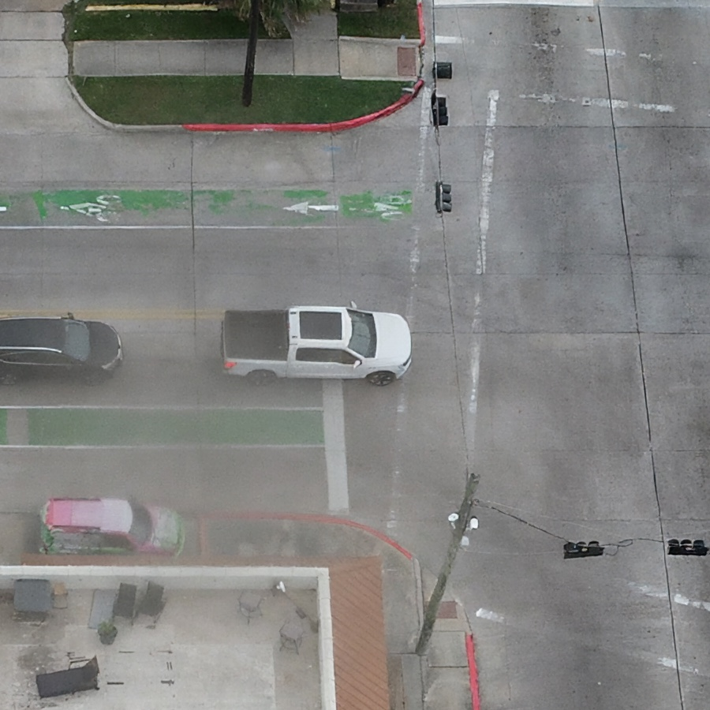
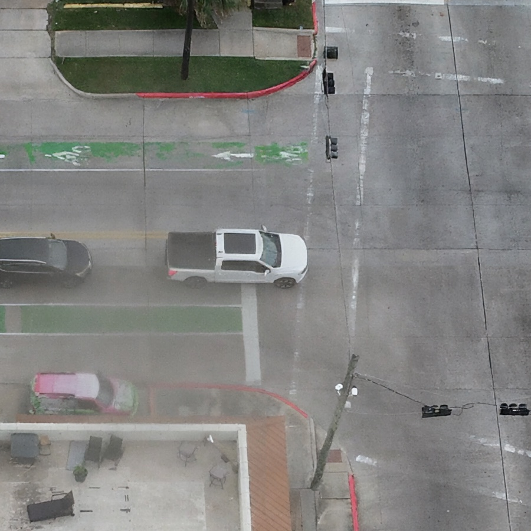

# 2026-05-12 Yifan Tiling Pilot Result

This folder records the DeltaAI GH200 `N_IMAGES=8` pilot run for Yifan's tiling experiment in the SC26 compression workflow.

## Scope

- System: DeltaAI GH200, partition `ghx4`
- SLURM job: `2275024`
- Run stamp: `20260512_yifan_tiling_pilot`
- Input: eight full-resolution drone images cropped to `5440 x 3648`
- Checkpoint: `baseline_b02048`
- Denoising steps: `65`
- Precision: `fp32`
- Tiling cases: no tiling, `512 x 512`, `1024 x 1024`, and `2048 x 2048`

The full raw output remains on DeltaAI:

```text
/projects/bfod/$USER/cdc-deltaai/output/sc26_compression/20260512_yifan_tiling_pilot/03_tiling_sweep/
```

## Key Finding

The `512 x 512` tiled run is the best current speed and memory setup. It reduced wall time by about 40 percent and peak GPU memory by about 17.2x compared with full-image compression, while keeping PSNR and SSIM close to the no-tiling reference.

| Setup | Time per image | Peak GPU memory | Compression ratio | PSNR | SSIM | Seam metric |
| --- | --- | --- | --- | --- | --- | --- |
| No tiling | 143.55 s | 52.0 GB | 72.74x | 29.88 | 0.8847 | n/a |
| 512 tile | 86.01 s | 3.0 GB | 68.79x | 29.73 | 0.8822 | 0.027796 |
| 1024 tile | 88.35 s | 11.2 GB | 66.11x | 29.82 | 0.8835 | 0.028595 |
| 2048 tile | 95.39 s | 43.8 GB | 66.04x | 29.90 | 0.8841 | 0.031026 |

## Interpretation for Weekly Progress

The pilot confirms the smoke-test trend on eight images. Smaller tiles give the largest memory reduction and the fastest runtime. The `1024 x 1024` and `2048 x 2048` cases keep PSNR and SSIM slightly closer to no tiling, but they use more GPU memory and run slower than `512 x 512`.

For the weekly update, use `512 x 512` as the recommended default for speed and memory. Before final poster reporting, rerun the selected setup on a larger image set.

## Visual Artifact Check

Visual inspection of the saved overviews and same-region crops found no obvious grid-like stitching seams in the `512 x 512`, `1024 x 1024`, or `2048 x 2048` stitched outputs for image `100_0005_0001`. The road surface contains real lane markings, pavement boundaries, and compression haze, but the tiled outputs do not show a new regular tile boundary pattern in the checked region.

Use the seam-region examples below as the quick visual evidence:





## Files

| File | Use |
| --- | --- |
| `tables/combined_summary.csv` | Machine-readable pilot summary |
| `tables/combined_summary.md` | Markdown table copied from the DeltaAI combined summary |
| `visual_examples_small/*_overview.jpg` | Downsampled overview images for no tiling and each tile size |
| `visual_examples_small/*_seam_region.jpg` | Crops from the same road/intersection region for visual seam inspection |
